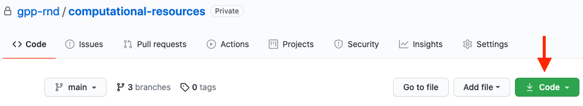
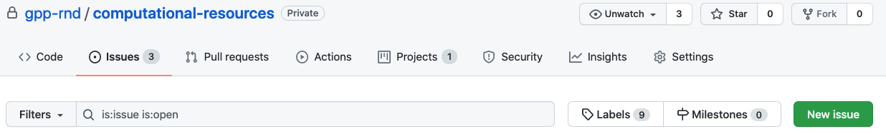

# GitHub 

[Github](https://github.com/) is a code hosting platform for version control and collaboration. GitHub lets 
collaborators code review, contribute, and report bugs on your projects. It is based on the Git version control system. 
GitHub can also be used to keep a version of your code on the cloud. There are afew other code hosting platforms such as 
SourceForge, Bitbucket and GitLab.

GitHub user accounts are free and can be created [here](https://github.com)

## R&D Github
Once you have a GitHub account, please email *mhegde@broadinstitute.org* to be added to the 
[GPP R&D](https://github.com/gpp-rnd) group. 

## Github terms:
1. **Repository**: A project is referred to as a repository in GitHub. For eg. the [GPP R&D](https://github.com/gpp-rnd) 
   group has repositories apron, poola, sglearn etc. 
2. **Remote repository**: Versions of your project that are hosted on the cloud/web (github.com)
3. **Local repository**: Versions of your project that lives locally on your machine. 
4. **Clone**: Making a copy of the remote version of a project on your local machine. This can be done using the command 
   *git clone*
5. **Commit**: Saving your changes to the local repository.
6. **Push**: Transferring your local commits to the remote repository. 
7. **Pull**: Fetch changes from a remote repository to your local repository.

## Github projects on your computer
To make a copy of the *[computational-resources](https://github.com/gpp-rnd/computational-resources)* repository onto your computer:

1. Open your terminal
   
2. `cd`* into the folder where you want to make a copy of the repository.
   
3. Type:  `git clone https://github.com/gpp-rnd/computational-resources.git`. This link can be found by clicking the 
   green "Code" button in the repository page.
   
   

*Refer to the "01_Shell_Commands" folder in the "01_Introduction" folder for details on this command.

## Github for Broadies
To link your account to the broadinstitute GitHub team, please follow the instructions for "GitHub for Broadies" on 
[this](https://intranet.broadinstitute.org/bits/service-catalog/software-development-support/github) page.

## GitHub Issues

GitHub provides a great interface for reporting bugs and making suggestions for repositories. 
If you have any ideas or notice something wrong with the computational-resources repository, 
we suggest that you create an issue on GitHub, so it's tracked in a central location. To create an issue go to 
the issues tab and click on New issue. 

Please be specific when creating an issue, so someone else (or yourself) can understand it and 
improve the computational-resources repository for future versions.
