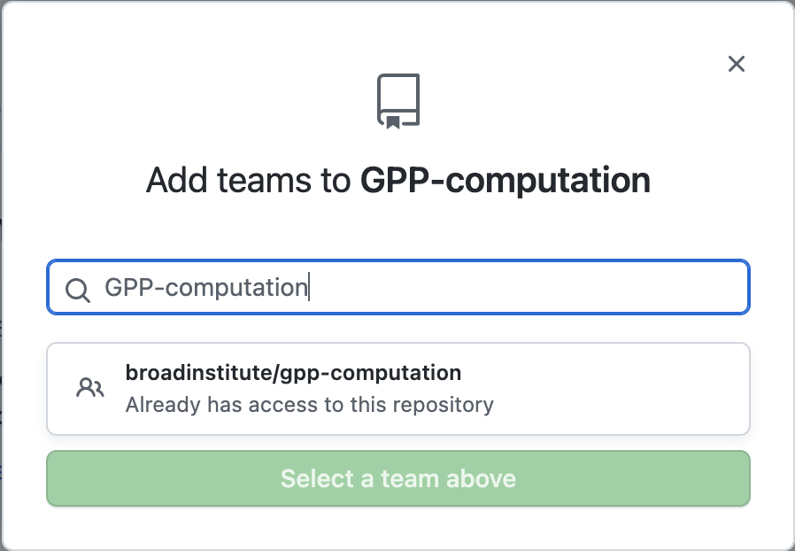

## GitHub broadinstitute organization

### Link your GitHub account to the broadinstitute organization

Instructions can be found [here](https://broad.service-now.com/sp?sys_kb_id=5194989a4faaa2c04e33afdd0210c711&id=kb_article_view&sysparm_rank=1&sysparm_tsqueryId=a563a59a47c9d190136902f3846d436a).

## GPP-computation team

In order to organize GPP-specific repositories under the broadinstitute organization, we have created a team called "[GPP-computation](https://github.com/orgs/broadinstitute/teams/gpp-computation/members)" (not to be confused with the GPP Informatics team), which corresponds to a Google group. 

### Add members to the GPP-computation team

Please reach out to one of the computationalists to be added to the GPP-computation GitHub team. The computationalists have "owner" access to the Google group. 

Directions for owners of the GPP-computation Google group to add members: 
1. Sign in to your Broad Gmail account
2. Go to Google apps (9 dots on the top right of your screen) and click on "Groups."
3. Search or scroll to gpp-computation.
4. Click on "People" on the left side of the page.
5. Click "Add members" at the top of the page.
6. Enter the email addresses of Group members, managers, and/or owners you would like to add.

### Create new repositories under the broadinstitute organization (preferred)

1. Go to the [broadinstitute organization page](https://github.com/broadinstitute) on GitHub.
2. Click on the green "New" button under "Repositories" on the Overview page.

### Give members of GPP-computation access to a repository

We recommend giving access to the group of GPP-computation access to a repository rather than individual members so that as members leave and new members are added the access settings for each repository don't need to be changed. 

1. In a repository that's under broadinstitute, go to "Settings."

2. Click on "Collaborators and teams" under the "Access" heading on the left side of the page. 

3. Under "Manage Access" select "Add Teams."

4. Type in "gpp-computation" and select the team. We recommend giving the team Admin access, unless there are specific concerns, to avoid access issues. 

### How to move existing repositories to broadinstitute organization
We recommend creating any new repositories under the broadinstitute organization, but you can follow these steps to movie any existing repositories that are currently stored elsewhere to broadinstitute.

1. In the repository that is not yet under broadinstitute, go to "Settings."

2. Scroll all the way down to the bottom, and select "Transfer."

3. Enter "broadinstitute" as the "New owner’s GitHub username or organization name" and type the current name of the repository as directed in the second field. Click "I understand, transfer this repository" to confirm. _Please note: the repo shown in this example is already part of the broadinstitute organization._

4. To gain admin access to the repository, go the "#github" channel in Slack. Click the '+' at the bottom of the text box where you would normally write a new message. 

5. Select "Request Repo Admin" from the menu that pops up.

6. Enter your GitHub username and URL of the GitHub repo you're trying to get access to. You can leave the "Admin Team Name" blank for now and give "admin" access to the team after you get access. 

Lukas Karlsson manages the broadinstitute GitHub organization and is generally pretty prompt with granting access requests. If you run into any issues, you can message him on Slack with any questions.

7. Follow the steps outlined in [Section 2.3](#Give-members-of-GPP-computation-access-to-a-repository) to give access to the GPP-computation team and any others as necessary.
