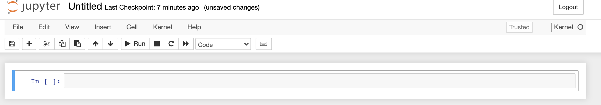
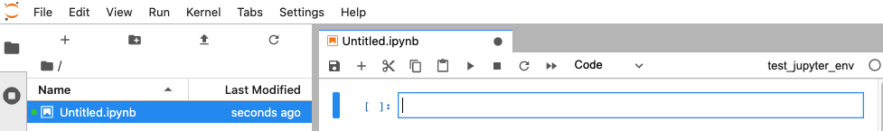

# Jupyter Notebooks

A Jupyter Notebook is an interactive programming environment for performing data analyses. Here we demonstrate how to install and
use Jupyter Notebooks.

## Setup

Using the Terminal create a new project directory and Python 3 virtual environment

```shell
yourname@something ~ % mkdir ~/Documents/test_jupyter
yourname@something ~ % cd ~/Documents/test_jupyter
```

In your new project folder, create and activate a virtual environment

```shell
yourname@something test_jupyter % conda create --name test_jupyter_env
yourname@something test_jupyter % conda activate test_jupyter_env
```

## Installing and Opening Jupyter Notebooks

You can install Jupyter Notebooks directly or through JupyterLab.

Both installation methods rely on `pip`, the package installer for Python, which 
can install any package on the [Python Package Index](https://pypi.org/) (PyPI).

### Jupyter Notebook

To install Jupyter Notebooks use

```shell
(test_jupyter_env) ... % pip install notebook 
```

Before running a Jupyter Notebook, make your virtual environment available as a notebook kernel. 
Notebook kernels are instances of Python that a notebook can run on.

```shell
(test_jupyter_env) ... % python -m ipykernel install --user --name test_jupyter_env
```

Now you can start a new Jupyter Notebook session with your virtual environment

```shell
(test_jupyter_env) ... % jupyter notebook
```

Create a new notebook with the test_jupyter_env kernel by selecting New and test_jupyter_env under the 
Notebook heading.


This will generate a notebook like the one below



### Jupyter Lab 

To install JupyterLab, which contains Jupyter Notebooks as well as an updated interface, enter

```shell
(test_jupyter_env) ... % pip install jupyterlab
```

Before starting JupyterLab, make your virtual environment available as a notebook kernel. 
Notebook kernels are instances of Python that a notebook can run on.

```shell
(test_jupyter_env) ... % python -m ipykernel install --user --name test_jupyter_env
```

Now you can launch JupyterLab with

```shell
(test_jupyter_env) ... % jupyter-lab
```

Create a new notebook by selecting the test_jupyter_env kernel 


This will open a new notebook in Jupyter Lab



### Which Method to Use

JupyterLab has an updated interface which allows for multi-window viewing. 
The notebook functionality will remain the same irrespective of which 
installation method you choose.

## Using Jupyter Notebooks

In the first cell in your open notebook type

```python
1 + 1
```

Click the run button in the menu or use shift + enter to run the code cell.

You can modify the type of each cell by switching from code to markdown in the menu.
Markdown is a syntax for writing rich text documents. In a markdown cell type

```markdown
#### Test Jupyter Notebooks

I'm testing out **Jupyter Notebooks**

* I 
* Am
* Excited
```

When you run the markdown cell you see that Jupyter formats this text as:

#### Test Jupyter Notebooks

I'm testing out **Jupyter Notebooks**

* I 
* Am
* Excited

When you are done working on a project first save your notebook. 
Then exit from the Jupyter server by opening the Terminal window with the running server 
running in and type `ctrl + c`.

## References

* [markdown syntax](https://www.markdownguide.org/basic-syntax/)
* [Jupyter Notebooks](https://jupyter-notebook.readthedocs.io/en/latest/index.html)
* [JupyterLab](https://jupyterlab.readthedocs.io/en/stable/)
* [Jupyter Notebook Extensions](https://jupyter-contrib-nbextensions.readthedocs.io/en/latest/)
