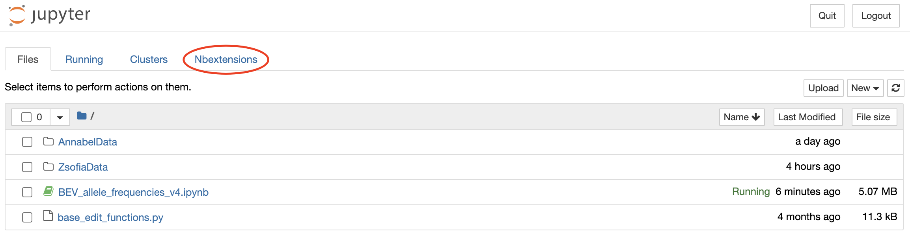
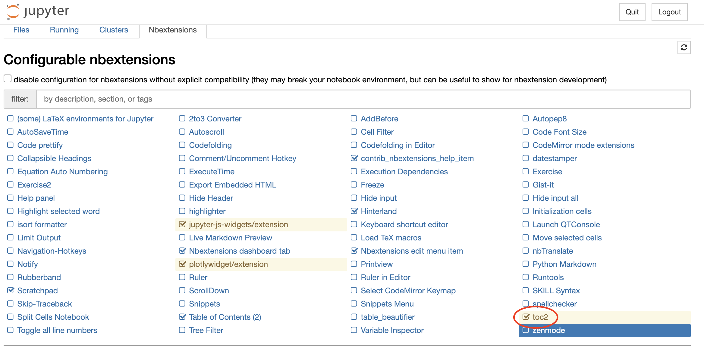
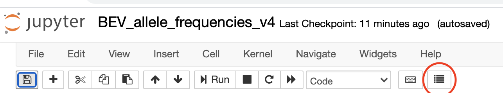
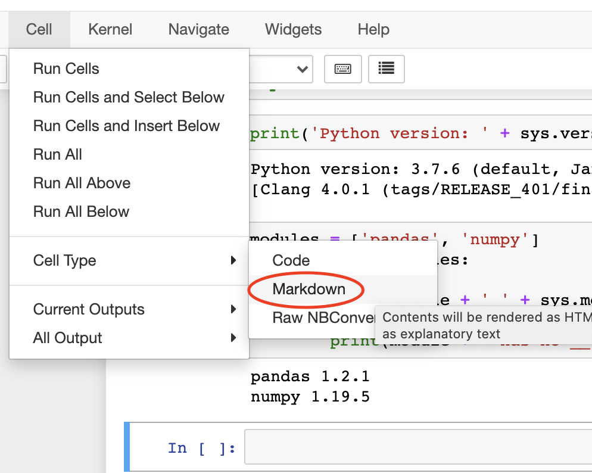
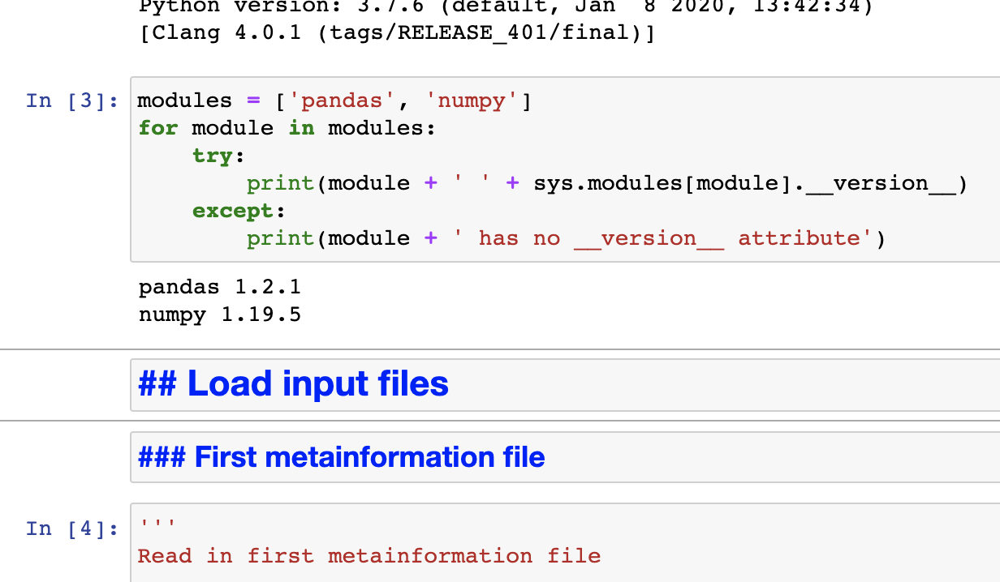
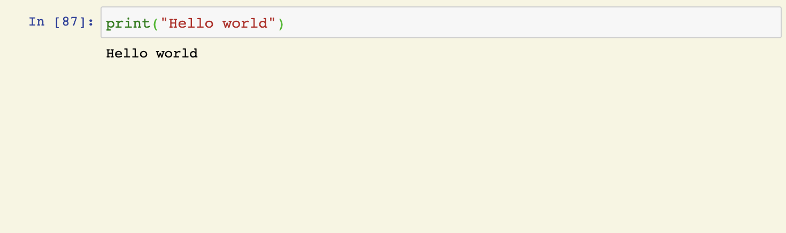

```python
from IPython.display import HTML

HTML('''<script>
code_show=true; 
function code_toggle() {
 if (code_show){
 $('div.input').hide();
 } else {
 $('div.input').show();
 }
 code_show = !code_show
} 
$( document ).ready(code_toggle);
</script>
<form action="javascript:code_toggle()"><input type="submit" value="Click here to hide/view the raw code"></form>''')
```


<script>
code_show=true; 
function code_toggle() {
 if (code_show){
 $('div.input').hide();
 } else {
 $('div.input').show();
 }
 code_show = !code_show
} 
$( document ).ready(code_toggle);
</script>
<form action="javascript:code_toggle()"><input type="submit" value="Click here to hide/view the raw code"></form>


```python
%%html
<style>
kbd {
    background-color: #eee;
    border-radius: 3px;
    border: 1px solid #b4b4b4;
    box-shadow: 0 1px 1px rgba(0, 0, 0, .2), 0 2px 0 0 rgba(255, 255, 255, .7) inset;
    color: #333;
    display: inline-block;
    font-family: 'Trebuchet MS';
    font-size: 1em;
    font-weight: 700;
    line-height: 1;
    padding: 2px 4px;
    white-space: nowrap;
   }
</style>
```


<style>
kbd {
    background-color: #eee;
    border-radius: 3px;
    border: 1px solid #b4b4b4;
    box-shadow: 0 1px 1px rgba(0, 0, 0, .2), 0 2px 0 0 rgba(255, 255, 255, .7) inset;
    color: #333;
    display: inline-block;
    font-family: 'Trebuchet MS';
    font-size: 1em;
    font-weight: 700;
    line-height: 1;
    padding: 2px 4px;
    white-space: nowrap;
   }
</style>


# Jupyter Notebooks: Shortcuts and Tips

# Keyboard Shortcuts

Jupyter Notebooks has an extensive list of keyboard shortcuts to help you write code more efficiently. If you find yourself having to use your mouse a lot to do something, chances are, there's a keyboard shortcut for it. 

Here are some useful Mac keyboard shortcuts for using Jupyter notebooks. For a full list of keyboard shortcuts, in the menu bar at the top of a Jupyter notebook go to <kbd>Help</kbd> > <kbd>Keyboard shortcuts</kbd> or press <kbd>H</kbd> in command mode (see below). You can then click <kbd>Edit Shortcuts</kbd> if you'd like to add shortcuts in addition to the existing ones. 

## Modes

There are two modes in Jupyter notebook. Keyboard shortcuts vary depending on which mode you are in.

1. <b>Edit mode: </b>
    * can edit text in selected cell
    * enter mode by pressing <kbd>return</kbd> or by clicking on the grey editor area of the cell
    * indicated by green border
2. <b>Command mode: </b>
    * cannot edit text in selected cell, but can edit notebook as a whole by deleting cells, adding cells, copying cells, etc.
    * enter mode by pressing <kbd>esc</kbd> or by clicking outside of the editor area of the cell
    * indicated by grey border and blue left margin around cell

## Shortcuts in both modes

### Run cell

<kbd>shift</kbd> + <kbd>return</kbd> : run cell and select below

### Save and checkpoint

<kbd>&#8984; command</kbd> + <kbd> S </kbd>

## Shortcuts in Edit Mode

Press <kbd>return</kbd> or click grey editor area of the cell

### Undo

<kbd>&#8984; command</kbd>+<kbd>Z</kbd>

### Select all

<kbd>&#8984; command</kbd>+<kbd>A</kbd>

### Comment (line or block)

<kbd>&#8984; command</kbd>+<kbd>/</kbd> : with cursor at any point in line or with text highlighted

### Right indent

<kbd>&#8984; command</kbd>+<kbd>]</kbd>: with cursor at any point in line or with text highlighted
<br/>
or
<br/>
<kbd>tab</kbd>: with cursor at beginning of single line or with text highlighted; also for code completion

### Left indent (dedent)

<kbd>&#8984; command</kbd>+<kbd>[</kbd>: with cursor at any point in line or with text highlighted
<br/>
or
<br/>
<kbd>shift</kbd>+<kbd>tab</kbd>: with cursor at beginning of single line or with text highlighted 

### Go to beginning of cell

<kbd>&#8984; command</kbd>+<kbd>&uarr;</kbd>

### Go to end of cell

<kbd>&#8984; command</kbd>+<kbd>&darr;</kbd>

### Go to beginning of line

<kbd>&#8984; command</kbd>+<kbd>&larr;</kbd>

### Go to end of line

<kbd>&#8984; command</kbd>+<kbd>&rarr;</kbd>

### Highlight line from cursor to end

<kbd>shift</kbd>+<kbd>&#8984; command</kbd>+<kbd>&rarr;</kbd>

### Highlight line from cursor to beginning

<kbd>shift</kbd>+<kbd>&#8984; command</kbd>+<kbd>&larr;</kbd>

## Shortcuts in Command mode

Press <kbd>esc</kbd> or click outside the editor area

### Insert cell above

<kbd>&#8984; command</kbd>+<kbd>A</kbd>

### Insert cell below

<kbd>&#8984; command</kbd>+<kbd>B</kbd>

### Delete cells

<kbd>D</kbd>, <kbd>D</kbd>

### Cut cells

<kbd>X<kbd/>


```python

```


```python
print("hello")
print('world')
two = 1 + 1

```

### Copy cells

<kbd>C<kbd/>

### Paste cells

<kbd>V<kbd/>

# Other Tips

## Running shell commands from a notebook

Place a ! before a command
e.g. 
```!pip install poola```

## Magic commands

Shortcuts that start with %

### Print working directory

```python 
%pwd
```

### Autoreload modules 

Useful so you don't have to restart a notebook after installing or upgrading a package 

```python 
%load_ext autoreload
%autoreload 2
```

### List all magic commands

```python
%lsmagic
```

### View function documentation

<kbd>shift</kbd> + <kbd>tab</kbd> 

## Nbextensions

<b> Installation: </b>
1. Run the following terminal command:
```python 
pip install jupyter_contrib_nbextensions
```


2. Open jupyter notebooks and go to the <span style="color:blue">Nbextensions</span> tab



3. Select extensions 


### Table of contents

1. Install the 'toc2' NBExtension

2. Restart any jupyter notebooks you have open or open a new notebook and you should see this icon on the top toolbar.



4. Now to actually use it, add a cell where you want a header to be, and convert it to be of type "Markdown" by either using the keyboard shortcut <kbd>M</kbd> in command mode or by selecting the cell and going to the "Cell" tab in the toolbar.


5. To make a header, add "#" (how many depends on what level of header) and then a space for your text like this: (so ### is a subheader for ##). The keyboard shortcuts for the number of hashes are <kbd>1</kbd>, <kbd>2</kbd>, <kbd>3</kbd>, etc. in command mode.



```python

```

### Scratchpad

1. Select "Scratchpad" from the list of NBExtensions. 

2. Restart any jupyter notebooks you have open or open a new notebook and you should see this icon on the bottom right corner of your screen.


3. Click on the icon and a scratchpad should open, as shown below, where you can test out small chunks of code without affecting the rest of your notebook. 



```python

```


```python

```
