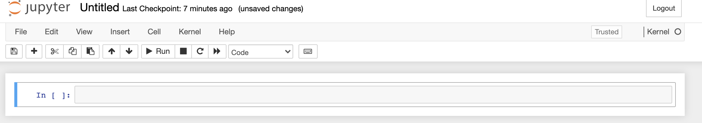

# Jupyter Notebooks

A Jupyter Notebook is an interactive programming environment for performing data analyses. Here we demonstrate how 
to install and use Jupyter Notebooks.

## Setup

Activate your base_analysis virtual environment from the Virtual Environments module.

```shell
yourname@something ~ % source ~/base_analysis/bin/activate
```

## Opening a Jupyter Notebook

Before running a Jupyter Notebook or Jupyter Lab, make your virtual environment available as a notebook kernel - instances of Python that a notebook can run on.

```shell
(base_analysis) ... % python -m ipykernel install --user --name base_analysis
```

You can start a new Jupyter Notebook session with your virtual environment

```shell
(base_analysis) ... % jupyter notebook
```

Create a new notebook with the base_analysis kernel by selecting New and base_analysis under the Notebook heading.


This will generate a notebook like the one below



**Tip** You can also launch a Jupyter-lab session with an updated interface that allows for multi-window viewing. The notebook functionality will remain the same irrespective of which installation method you choose.
```
jupyter-lab
```

## Using Jupyter Notebooks

In the first cell in your open notebook type

```python
1 + 1
```

Click the run button in the menu or use shift + enter to run the code cell.

You can modify the type of each cell by switching from code to markdown in the menu.
Markdown is a syntax for writing rich text documents. In a markdown cell type

```markdown
#### Test Jupyter Notebooks

I'm testing out **Jupyter Notebooks**

* I 
* Am
* Excited
```

When you run the markdown cell you see that Jupyter formats this text as:

#### Test Jupyter Notebooks

I'm testing out **Jupyter Notebooks**

* I 
* Am
* Excited

When you are done working on a project first save your notebook. 
Then exit from the Jupyter server by opening the Terminal window with the running server and type `ctrl + c`.

## What's Next

Check out [Jupyter_Notebooks_shortcut_tips.md](Jupyter_Notebooks_shortcut_tips.md) for shortcuts you can use in Jupyter. 
The resources below are also helpful references for learning more.

* [markdown syntax](https://www.markdownguide.org/basic-syntax/)
* [Jupyter Notebooks](https://jupyter-notebook.readthedocs.io/en/latest/index.html)
* [JupyterLab](https://jupyterlab.readthedocs.io/en/stable/)
* [Jupyter Notebook Extensions](https://jupyter-contrib-nbextensions.readthedocs.io/en/latest/)
