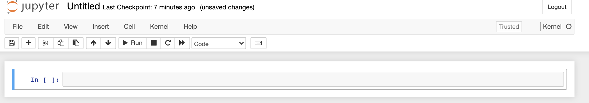
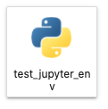
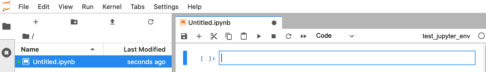

# Jupyter Notebooks

A Jupyter Notebook is an interactive programming environment for performing data analyses. Here we demonstrate how 
to install and use Jupyter Notebooks.

## Setup

Activate your comp_resources virtual environment from the Virtual Environments module.

```shell
yourname@something ~ % conda activate comp_resources
```

For this tutorial we suggest that you work in the Jupyter_Notebooks module on your computer
so you can reference any files you create at a later date.

```shell
(comp_resources) yourname@something ~ % cd path/to/05_Jupyter_Notebooks
```

## Installing and Opening Jupyter Notebooks

You can install Jupyter Notebooks directly or through JupyterLab.

If you have already pip installed the requirements.txt file in the Virtual Environments module, then Jupyter Notebooks should already be installed.

### Installing Jupyter Notebook

To install Jupyter Notebooks use

```shell
(comp_resources) ... % pip install notebook 
```

### Installing JupyterLab

To install JupyterLab, which contains Jupyter Notebooks as well as an updated user interface, enter

```shell
(comp_resources) ... % pip install jupyterlab
```

### Making virtual environment available as a notebook kernel

Before running a Jupyter Notebook or Jupyter Lab, make your virtual environment available as a notebook kernel 

```shell
(comp_resources) ... % python -m ipykernel install --user --name comp_resources
```

Notebook kernels are instances of Python that a notebook can run on.


### Opening Jupyter Notebook

You can start a new Jupyter Notebook session with your virtual environment

```shell
(comp_resources) ... % jupyter notebook
```

Create a new notebook with the comp_resources kernel by selecting New and comp_resources under the 
Notebook heading.


This will generate a notebook like the one below



### Opening Jupyter Lab

You can launch JupyterLab with

```shell
(comp_resources) ... % jupyter-lab
```

Create a new notebook by selecting the comp_resources kernel, which should have an 
icon like the one below



This will open a new notebook in Jupyter Lab



### Which Method to Use

JupyterLab has an updated interface which allows for multi-window viewing. 
The notebook functionality will remain the same irrespective of which 
installation method you choose.

## Using Jupyter Notebooks

In the first cell in your open notebook type

```python
1 + 1
```

Click the run button in the menu or use shift + enter to run the code cell.

You can modify the type of each cell by switching from code to markdown in the menu.
Markdown is a syntax for writing rich text documents. In a markdown cell type

```markdown
#### Test Jupyter Notebooks

I'm testing out **Jupyter Notebooks**

* I 
* Am
* Excited
```

When you run the markdown cell you see that Jupyter formats this text as:

#### Test Jupyter Notebooks

I'm testing out **Jupyter Notebooks**

* I 
* Am
* Excited

When you are done working on a project first save your notebook. 
Then exit from the Jupyter server by opening the Terminal window with the running server and type `ctrl + c`.

## What's Next

Check out the Jupyter_Notebooks_shortcut_tips for shortcuts you can use while working 
in Jupyter notebooks. The resources below are also helpful references for learning more.

* [markdown syntax](https://www.markdownguide.org/basic-syntax/)
* [Jupyter Notebooks](https://jupyter-notebook.readthedocs.io/en/latest/index.html)
* [JupyterLab](https://jupyterlab.readthedocs.io/en/stable/)
* [Jupyter Notebook Extensions](https://jupyter-contrib-nbextensions.readthedocs.io/en/latest/)
