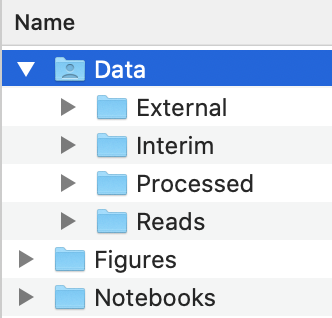
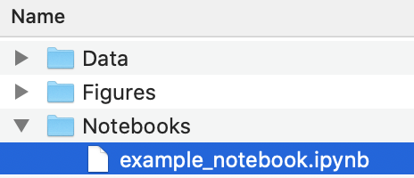
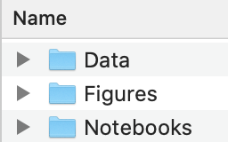
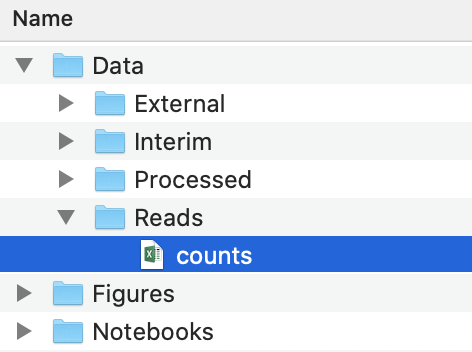

# File structure

## What is file structure?

File structure refers to how you organize your files and typically involves folders and sub-folders. 

## Why is it important?

It is important for both you and anyone who may access your code or data in the future to be able to find certain code or data files. 

## At what point in my analysis should I establish a file structure?

As a general rule, the earlier you do it the better, particularly if the project will be collaborative or longer-term. It becomes more difficult to go back and change file paths in code if the file structure is put in place later in the process. 

## How should I organize my files?

You can organize your files into folders however you think would make the most sense for your project. Below is our recommended starting point with each folder explained. You can feel free to add subfolders and rename folders as needed. 



### Data

As the name would suggest, this is a folder where you can store all of your data files. Since there are a variety of data files that may be used in a project, this folder has 4 subfolders.

#### Reads or Raw

This folder is where you can save the raw read count files and gene annotation files.  

#### Interim

This folder is a bit more ambiguous and may vary with the project, but it can be used to store data that isn't quite fully processed such as lognorms or log-fold changes that will be used to calculate z-scores. 

#### Processed

This folder contains processed scores such as log-fold changes or z-scores.

#### External

This folder contains data from external sources, such as essential and non-essential gene sets used for ROC-AUC analysis. 

### Figures

As the name would suggest, this folder is where you can store figures generated by your code. 

### Notebooks

This folder is where you can store any Jupyter notebooks used for the analysis. An important note when writing code in this folder is to be careful with your filepaths when reading or saving files because your code is living in a separate folder. 

<b>Tip:</b> '../' takes you back one folder 

#### Example: Reading files 

```python
import pandas as pd

reads = pd.read_csv('../Data/Reads/counts.txt', sep = '\t') 
```

<b>Filepath:</b> '../<span style="color:#31C4C1">Data/</span><span style="color:#632A50">Reads/</span><span style="color:#8EAB0D">counts.txt'</span> 
<br/>
<b>Starting point:</b>



<b>../</b> 

<br/>
<span style="color:#31C4C1"><b>Data/</b></span>

<br/>
<span style="color:#632A50"><b>Reads/</b></span><span style="color:#8EAB0D">counts.txt</span> 



#### Example: Saving files 

```python
import matplotlib.pyplot as plt
# bbox_inches = 'tight' makes sure the figure isn't cut off when it is saved
fig.savefig('../Figures/example_figure.png', bbox_inches = 'tight')
```
